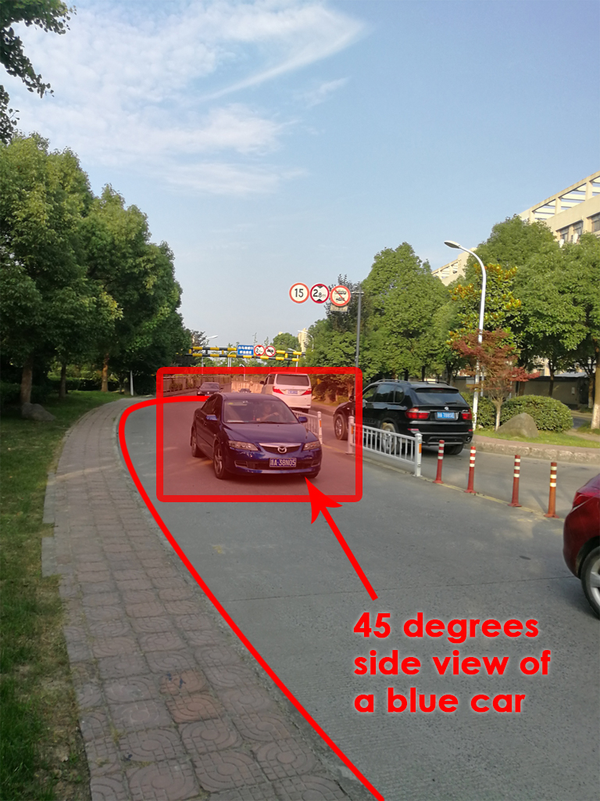

# 
**Industrial Placement Project Work and Outputs**
 

> **IMPORTANT**: mind that most of work I have done during my placement has been specified containing sensitive contents, therefore, after negotiation with the industry tutor, it has been agreed that, project works cannot be shown directly, but, I am allowed to use the same technique learnt from the placement and produce something else that is not straightly related to the interest of the company with providing very little portion of the source code. For the Data Acquisition session, photos of the scenes shown are taken by my phone and my colleagues only for the purpose of explanation of considerations for video capturing, none of the screenshots from the real surveillance camera are allowed to be provided.

 

# Data Acquisition

As the idiom says "One can't make bricks without straw". Investigation on image processing algorithms needs image/video data as crude resources. The following session introduces the process we proceeded to capture video sources as dataset for future algorithm tuning.

Obtaining video that captures that fits the needs for the training set is not simply placing a camera alongside the pedestrian and let it record. In order to obtain the video capture that maximises effective data input, trials and adjustments have to be done before figuring out the best shooting angle and height. Besides, even after we have found the appropriate location and wide angle for shooting we acquired for, essential "1 centimetre" micro-adjustments have been proceeded sometimes to find the just adequate position to mitigate an unwanted covering object such as branches of trees or a traffic sign. (Arguing with traffic police is certainly another issue that costs much effort during shootings but this is not within the technical discussions here)

<table>
  	<tr>
    	<th>Renke Setting up and Adjusting Surveillance Camera Angle</th>
  	</tr>
	<tr>
		<th></th>
	</tr>
</table>

 

## Scene 1: Tunnel Exit

### Main Features:

- Front-lighting / Noon
- Round Corner
- Vehicles mainly middle and smaller car, motors
- Mere pedestrians
- Tree branches and barricades presenting

In order to capture as many angles of views as possible, especially the gradual transition from front view to side view, we priorly chose road with round corners due that you cannot place the camera just facing in front of the cars in the middle of the road to shoot for the front. The first we have chosen was a large round corner of a road outside a tunnel exit. (remind again the following are just photos from my phone only for instructions thus the image quality and professionality is not of high proficient standard, screenshots from the real surveillance camera are not permitted to be provided)

<table>
  	<tr>
    	<th>Original</th>
    	<th>Shooting angle outlined</th>
  	</tr>
  	<tr>
    	<td></td>
    	<td></td>
  	</tr>
</table>

As shown below, by this angle, we can capture the front view of a car just at the exit of the tunnel, also the camera is high enough to obtain a large look down angle which is also useful for license plate investigations. When the cars come closer, front angle turns gradually to 45 degrees which by applying appropriate algorithms in the future, might be able to reconstruct the 3D car model, besides, the license plate has also been shot in a even larger looking down angle. When turning to 60 degrees side view, we can only see part of the car so the captures might not be as useful as the previous ones.

<table>
  	<tr>
    	<th>45 degrees side view</th>
    	<th>60 degrees partial side view</th>
    	<th>almost front view of a further car</th>
  	</tr>
  	<tr>
    	<td></td>
    	<td></td>
    	<td></td>
  	</tr>
</table>

On the other hand, originally we might choose a even closer position to capture as shown below. As you can perceive, this might be a even better angle for front view, however, the vehicles were partially covered by the traffic signs and barricade the pedestrians are almost completely being covered by tree branches. The latter reason vastly brought down the value of the image left only useful informations from the cars to be fed into the training data set. Due to the concerns of mitigating all the viewing obstacles, we have abandoned this position.

<table>
  	<tr>
    	<th>Shooting obstacles outlined if we chose a closer position</th>
  	</tr>
  	<tr>
    	<td></td>
  	</tr>
</table>

 

## Scene 2: Interception of Tunnel Exit with Urban Traffic Arterial

### Main Features:

- Back-lighting / Afternoon
- Large Round Corner with huge turn
- All Vehicles presenting
- Frequent pedestrians
- Tree branches, Traffic signs and barricades presenting but not covering key information

 

## Scene 3: A bridge in front of the Exit of a Housing Estate

### Main Features:

- Partial Back-lighting / Sunset
- Round Corner with a half complete turn
- Mostly motors and bicycles presenting
- All kinds of pedestrians
- Tree branches presenting but not covering key information

 

# 2D Image Processing Algorithms

<table>
  	<tr>
    	<th>Affine Transformation   Null pixels filled with light gray</th>
    	<th>Affine Transformation   Null pixels filled with dark gray</th>
    	<th>Affine Transformation   Null pixels filled with black</th>
  	</tr>
  	<tr>
		<td></td>
		<td></td>
		<td></td>
  	</tr>
</table>

# Rapid Prototypes of 2D Image Processing

Before directly aimlessly going into coding, it was more targeted to start with applying design engineering agile
approaching idea of rapid prototyping. I firstly try to investigate how environmental effects on camera lens can
influence the imaging. Then produce a rapid prototyping with Photoshop filters, After Effect 3Ds or GIMP tools
and try to deeply understand the logic behind parameters in each layer of filter and the influence of order of
layers.

## Motion Blur - Uniform & Linear

### Principle:

Motion blur is the apparent streaking of moving objects in a photograph or a sequence of frames, such as a film or animation. It results when the image being recorded changes during the recording of a single exposure, due to rapid movement or long exposure.

### Generation:

#### Algorithms:

In general there are two parameters which need to be considered when dealing with such a blur. Intuitively, these are the magnitude and the direction of the blur. To replicate motion blur using a blur kernel we start by constructing a matrix of zeroes. We then replace the entries of a specific row with 1's (usually the middle row), to imitate the effect of the blur. Finally we rotate the matrix by a specified angle and normalise it.

	

**Randomly generated motion blur orientation and extent**

<table>
  	<tr>
    	<th>Original</th>
    	<th>Horizontal     6 pixels shifting</th>
		<th>118 degrees    5 pixels shifting</th>
		<th>93 degrees     7 pixels shifting</th>
		<th>4 degrees     11 pixels shifting</th>
  	</tr>
  	<tr>
    	<td></td>
    	<td></td>
		<td></td>
		<td></td>
		<td></td>
  	</tr>
</table>

### Compensation:

#### Prototype: Sharpening with Emboss

**the original image**

<table>
	<tr>
		<th></th>
	</tr>
</table>

##### 1) Smart Sharpening:

No pre-set settings, carry out experiments, due that their angles, pixels are very different to each other

If we crop the image to the place most significantly shows the effect of motion blur (in this case: around eyes)

<table>
  	<tr>
    	<th>Original</th>
    	<th>After Smart Sharpening</th>
  	</tr>
  	<tr>
    	<td></td>
    	<td></td>
  	</tr>
</table>

##### 2) Further compensating with Emboss

- Emboss with Angle opposite to the angle of removing sharpening, if the same angle as above, will compound the halos
    
	- Height: 1px
	- Amount: 500%
	- Blending Option: Overlay (or try other modes in the overlay category)

<table>
  	<tr>
    	<th>After Smart Sharpening</th>
    	<th>After Emboss</th>
  	</tr>
  	<tr>
    	<td></td>
    	<td></td>
  	</tr>
</table>

Emboss Algorithm: <https://www.packtpub.com/mapt/book/application_development/9781785283932/2/ch02lvl1sec23/embossing>

**Blend Mode: Overlay:**

<table>
  	<tr>
    	<th>Emboss Normal Blend Mode</th>
    	<th>Emboss Overlay Blend Mode</th>
  	</tr>
  	<tr>
    	<td></td>
    	<td></td>
  	</tr>
</table>

 

<!-------------------- Motion Blur Session Finished -------------------->

## More Sharpening

**"Sharpen More" filter**: old raw command working on low resolution images

**"Unsharp Mask(important)" filter**: old school conventional technique: take the image, blur it then invert it and apply it as a mask of the original image

> - Unsharp Mask is essentially brightening the bright side of and edge, and darkening the dark edge
> - Thickness of the edge is determined by the **Radius**,
> - Threshold calms down the sharpening of the noise which is arbitrary variations in neighbouring pixels. Taking the threshold value up will eliminate the sharpening of he noises

- Principle:

	- https://en.wikipedia.org/wiki/Unsharp_masking
	- https://www.cambridgeincolour.com/tutorials/unsharp-mask.htm
	- https://docs.gimp.org/en/plug-in-unsharp-mask.html

- Implementation:

	- http://www.cnblogs.com/Imageshop/archive/2013/05/19/3086388.html
	- https://blog.csdn.net/matrix_space/article/details/78345483 (WITHOUT OpenCV)

- "**Blending sharpening effect**":

	> - For exaggerated Unsharp Mask effects, we get some sort like purple surrounded by yellow, which is due that we are sharpening all three channels
	> - change the blend mode from normal to luminosity and those edges will disappear, because we are no longer sharpening the colour but just sharpening the details
	> - ALWAYS using **`amount`** of max 500, blending mode of luminosity and change the opacity of the mask to adjust

- "**Smart Sharpen**":

	> - by comparing with the above sharpening effect, less halos along the edge and less black areas
	> - Use Gaussian Blur to produce the unsharpening effect

- "**Lens Blur and Reduce Noise**":
  
	- Smart Sharpen, Amount 500%; Radius 4.5px; 50% Reduce Noise

	> Gaussian Blur is designed when you down sample an image or working with a scanned photograph, but when working with a digital photograph, Lens Blur is going to produce better, crisper effects.

"**Preventing Shadow/highlight clipping**"(by far best outcome):

- Amount: 500%
- Radius: 6.0px
- Reduce Noise: 50%

	**Shadows**:

	- Fade Amount: 10%
	- Tonal Width: 50%
	- Radius: 50px

	**Highlights**:
    
	- Fade Amount: 10%
    - Tonal Width: 50%
    - Radius: 50px
    
	"**Sharpening with the High Pass Filter**":
  
	> it naturally avoids clipping, which is useful for sharpening portrait shots
  	
	> Both High Pass and Unsharp Mask reply on Gaussian Blur to do the sharpening
  	
	> give you a more pronounced, colourful effect

 

## Pixelation in Photoshop

### Compensation: de-pixelation

> Bicubic Interpolation - Computerphile: <https://www.youtube.com/watch?v=poY_nGzEEWM>

1. --> Image Size (Alt + Ctrl + I) --> Resolution: change the resolution to 300 pixels per inch or higher if you want, then make sure **Bicubic Automatic** option is selected
2. --> Filter --> Noise --> Reduce Noise --> play around with the settings:
    
	- Strength: 10
    - Preserve Details: 0
    - Reduce Colour Noise: 86%
    - Sharpen Details: 52%
    - tick Remove **JPEG Artifact**

<table>
  	<tr>
    	<th>Image with very Low Resolution</th>
    	<th>Image after De-pixelation</th>
  	</tr>
  	<tr>
    	<td></td>
    	<td></td>
  	</tr>
</table>

 

<!-------------------- Pixelation Session Finished -------------------->

## Affine Transformation

#### 1. Lens Correction

1. rename and convert to smart object 
2. check:
    - Geometric Distortion
    - Chromatic Aberration
    - Vignette
        > Vignette is darkening around the corners of the image essentially caused by lens element
        > to get rid of it, that's brighten up the colour

#### 2. Distortion, Aberration and Vignette
    
1. choose `Custom` setting tag of `Lens Correction`
2. go to upper-left corner of the window, start with the `Remove Distortion Tool`:
    - dragging outward: add barrel distortion
    - dragging inward: add pincushioning distortion
3. play around with the settings in `Chromatic Aberration` and `Vignette`

#### 3. Adjusting Angle and Perspective  

1. navigate to the `Transform` tag, play around with the `Angle`
2. choose `Move Grid Tool`, change in the bottom, the grid `Color` to make the grid contrastively visible and `Size` to make it align better with the image features.  
3. go back to the `Transform` tag, play around with the `Horizontal Perspective` and `Vertical Perspective`.
    
#### 4.1 Using the Perspective Warp Command

1. set 4 `Guidelines`
2. go to `Edit`, navigate to `Perspective Warp`
    
	- establish a base setting for our boundaries that the vertices should align to the four points you want to use as reference points
	- click `Enter` entering the edit mode in step 2 to drag and adjust the image

<table>
  	<tr>
    	<th>Original Image</th>
    	<th>Image after Perspective Wrap</th>
  	</tr>
  	<tr>
    	<td></td>
    	<td></td>
  	</tr>
</table>
       
#### 4.2 Fine-Tuning the Perspective Adjustment

1. gradually improve the image by playing around the 4 vertices
2. after the four vertices of the perspective warping box aligned to the 4 boundary vertices, check if there is still geometric distortions by checking whether there are slightly curved lines. Go back to step 1 and adjust the `Geometric Distortion` value for further compensation.
    
> Beware that the last step has no preview effect influenced by the later action of perspective warp

<table>
  	<tr>
    	<th>Image after Perspective Wrap</th>
    	<th>Image after Lens Correction (solve fish-eye)</th>
  	</tr>
  	<tr>
    	<td></td>
    	<td></td>
  	</tr>
</table>

#### 5. Evening out Colour and Lighting

> This section has nothing to do with the `Lens Correction` filter but everything to do with quality image editing.

1. make sure the image layer has been selected and go to the bottom of the image click the first icon and select `Color Overlay`. 
2. darken the image by navigate to `Layer`, choose `Brightness/Contrast...` 
    - select the blend mode to `Multiply`
    - set the `Opacity` to `50%`
3. choose the layer mask, choose `Brush` and draw on the image's dark spots and lighten them.

<table>
  	<tr>
    	<th>Image after Lens Correction</th>
    	<th>Image after Lens Colour/ Brightness/ Contrast Tuning</th>
  	</tr>
  	<tr>
    	<td></td>
    	<td></td>
  	</tr>
</table>

---
 