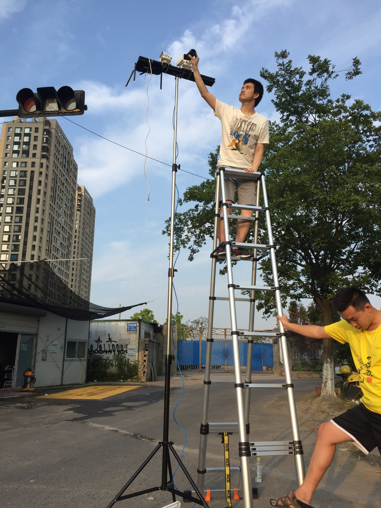

# Industrial Placement Project Work and Outputs

> **IMPORTANT**: mind that most of work I have done during my placement has been specified containing sensitive contents, therefore, after negotiation with the industry tutor, it has been agreed that, project works cannot be shown directly, but, I am allowed to use the same technique learnt from the placement and produce something else that is not straightly related to the interest of the company with providing very little portion of the source code. For the Data Acquisition session, photos of the scenes shown are taken by my phone and my colleagues only for the purpose of explanation of considerations for video capturing, none of the screenshots from the real surveillance camera are allowed to be provided.

## Data Acquisition

As the idiom says "One can't make bricks without straw". Investigation on image processing algorithms needs image/video data as crude resources.

Obtaining video that captures what 

<table>
	<tr>
		<th></th>
	</tr>
</table>

## Rapid Prototypes of 2D Image Processing

Before directly aimlessly going into coding, it was more targeted to start with applying design engineering agile
approaching idea of rapid prototyping. I firstly try to investigate how environmental effects on camera lens can
influence the imaging. Then produce a rapid prototyping with Photoshop filters, After Effect 3Ds or GIMP tools
and try to deeply understand the logic behind parameters in each layer of filter and the influence of order of
layers.

### Motion Blur - Uniform & Linear

#### Principle:

Motion blur is the apparent streaking of moving objects in a photograph or a sequence of frames, such as a film or animation. It results when the image being recorded changes during the recording of a single exposure, due to rapid movement or long exposure.

#### Generation:

##### Algorithms:

In general there are two parameters which need to be considered when dealing with such a blur. Intuitively, these are the magnitude and the direction of the blur. To replicate motion blur using a blur kernel we start by constructing a matrix of zeroes. We then replace the entries of a specific row with 1's (usually the middle row), to imitate the effect of the blur. Finally we rotate the matrix by a specified angle and normalise it.

	

#### Compensation:

##### Prototype: Sharpening with Emboss

**the original image**

<table>
	<tr>
		<th></th>
	</tr>
</table>

###### 1) Smart Sharpening:

No pre-set settings, carry out experiments, due that their angles, pixels are very different to each other

If we crop the image to the place most significantly shows the effect of motion blur (in this case: around eyes)

<table>
  	<tr>
    	<th>Original</th>
    	<th>After Smart Sharpening</th>
  	</tr>
  	<tr>
    	<td></td>
    	<td></td>
  	</tr>
</table>

###### 2) Further compensating with Emboss

- Emboss with Angle opposite to the angle of removing sharpening, if the same angle as above, will compound the halos
    
	- Height: 1px
	- Amount: 500%
	- Blending Option: Overlay (or try other modes in the overlay category)

<table>
  	<tr>
    	<th>After Smart Sharpening</th>
    	<th>After Emboss</th>
  	</tr>
  	<tr>
    	<td></td>
    	<td></td>
  	</tr>
</table>

Emboss Algorithm: <https://www.packtpub.com/mapt/book/application_development/9781785283932/2/ch02lvl1sec23/embossing>

**Blend Mode: Overlay:**

<table>
  	<tr>
    	<th>Emboss Normal Blend Mode</th>
    	<th>Emboss Overlay Blend Mode</th>
  	</tr>
  	<tr>
    	<td></td>
    	<td></td>
  	</tr>
</table>