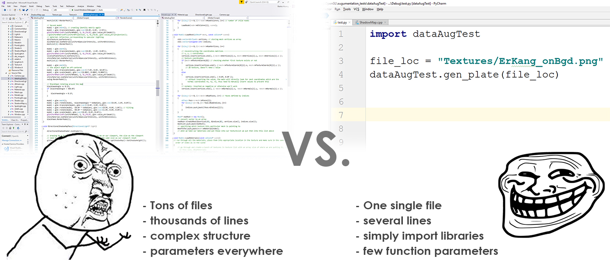

<h1 align="center">
	Boost Python Wrapper
</h1>

After developed my part of the algorithm, I have to make the algorithms produced portable for all other colleagues to utilize by wrapping into libraries functions and output to other languages (normally python). I achieved by learning the Boost.Python package which can enable using simple python lines to call very complicated C++ functions. Furthermore, through learning the package, I got an insight of how industry standard programming manages and coordinate portability and the finishing of one’s work. 

