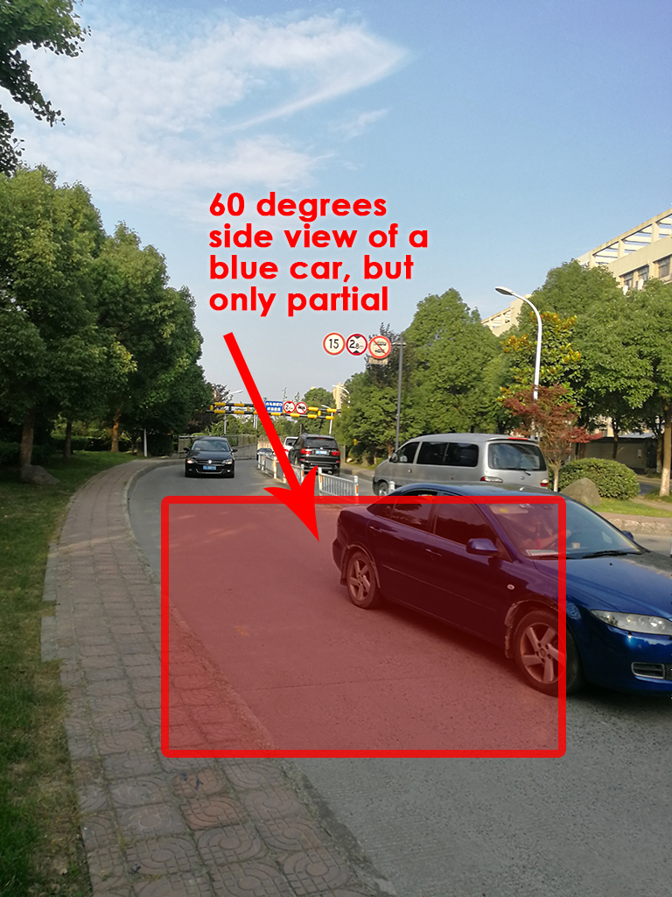
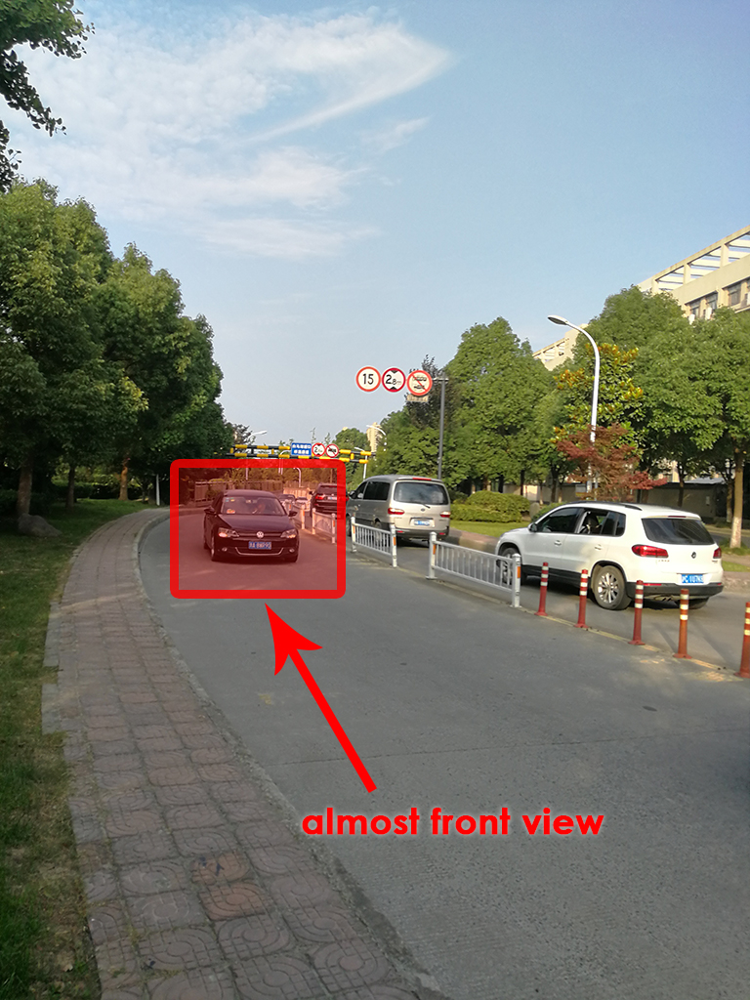

# 
**Data Acquisition**
 

> **IMPORTANT**: mind that most of work I have done during my placement has been specified containing sensitive contents, therefore, after negotiation with the industry tutor, it has been agreed that, project works cannot be shown directly, but, I am allowed to use the same technique learnt from the placement and produce something else that is not straightly related to the interest of the company with providing very little portion of the source code. For the Data Acquisition session, photos of the scenes shown are taken by my phone and my colleagues only for the purpose of explanation of considerations for video capturing, none of the screenshots from the real surveillance camera are allowed to be provided.

 

As the idiom says "One can't make bricks without straw". Investigation on image processing algorithms needs image/video data as crude resources. The following session introduces the process we proceeded to capture video sources as dataset for future algorithm tuning.

Obtaining video that captures that fits the needs for the training set is not simply placing a camera alongside the pedestrian and let it record. In order to obtain the video capture that maximises effective data input, trials and adjustments have to be done before figuring out the best shooting angle and height. Besides, even after we have found the appropriate location and wide angle for shooting we acquired for, essential "1 centimetre" micro-adjustments have been proceeded sometimes to find the just adequate position to mitigate an unwanted covering object such as branches of trees or a traffic sign. (Arguing with traffic police is certainly another issue that costs much effort during shootings but this is not within the technical discussions here)

<table>
  	<tr>
    	<th>Renke Setting up and Adjusting Surveillance Camera Angle</th>
  	</tr>
	<tr>
		<th></th>
	</tr>
</table>

 

## Scene 1: Tunnel Exit

### Main Features:

- Front-lighting / Noon
- Round Corner
- Vehicles mainly middle and smaller car, motors
- Mere pedestrians
- Tree branches and barricades presenting

In order to capture as many angles of views as possible, especially the gradual transition from front view to side view, we priorly chose road with round corners due that you cannot place the camera just facing in front of the cars in the middle of the road to shoot for the front. The first we have chosen was a large round corner of a road outside a tunnel exit. (remind again the following are just photos from my phone only for instructions thus the image quality and professionality is not of high proficient standard, screenshots from the real surveillance camera are not permitted to be provided)

<table>
  	<tr>
    	<th>Original</th>
    	<th>Shooting angle outlined</th>
  	</tr>
  	<tr>
    	<td></td>
    	<td></td>
  	</tr>
</table>

As shown below, by this angle, we can capture the front view of a car just at the exit of the tunnel, also the camera is high enough to obtain a large look down angle which is also useful for license plate investigations. When the cars come closer, front angle turns gradually to 45 degrees which by applying appropriate algorithms in the future, might be able to reconstruct the 3D car model, besides, the license plate has also been shot in a even larger looking down angle. When turning to 60 degrees side view, we can only see part of the car so the captures might not be as useful as the previous ones.

<table>
  	<tr>
    	<th>45 degrees side view</th>
    	<th>60 degrees partial side view</th>
    	<th>almost front view of a further car</th>
  	</tr>
  	<tr>
    	<td></td>
    	<td></td>
    	<td></td>
  	</tr>
</table>

On the other hand, originally we might choose a even closer position to capture as shown below. As you can perceive, this might be a even better angle for front view, however, the vehicles were partially covered by the traffic signs and barricade the pedestrians are almost completely being covered by tree branches. The latter reason vastly brought down the value of the image left only useful informations from the cars to be fed into the training data set. Due to the concerns of mitigating all the viewing obstacles, we have abandoned this position.

<table>
  	<tr>
    	<th>Shooting obstacles outlined if we chose a closer position</th>
  	</tr>
  	<tr>
    	<td></td>
  	</tr>
</table>

 

## Scene 2: Interception of Tunnel Exit with Urban Traffic Arterial

### Main Features:

- Back-lighting / Afternoon
- Large Round Corner with huge turn
- All Vehicles presenting
- Frequent pedestrians
- Tree branches, Traffic signs and barricades presenting but not covering key information

For the second scene, we chose the other side of the tunnel, not only due that it is the interception the main  arterial thus we can maximise the ID of the cars in traffic flow, but also because of the back-lighting due to strong sunlight that provided us more choices of perspectives of studies of lighting. 

<table>
  	<tr>
    	<th>Original Photo</th>
  	</tr>
  	<tr>
		<td>
			
		</td>
	</tr>
</table>

As you can perceive from the image captures, under back lighting conditions, the car shows a thin layer of reflection of lighting on the contours frames leaving the main car body in contrasting darker shades. Which appears vastly different from the front lighting cases. Wide span of view provides us a views that contains a wide range of car IDs that is beneficial for the training algorithm developments.

<table>
  	<tr>
    	<th>View Span Outlined</th>
    	<th>Strong Back-lighting</th>
  	</tr>
  	<tr>
		<td>
			
		</td>
		<td>
			
		</td>
  	</tr>
</table>

**Various view angles of a same car**

<table>
  	<tr>
    	<th>Far</th>
    	<th>Front View</th>
    	<th>45 Degrees Side View</th>
    	<th>Side View</th>
  	</tr>
  	<tr>
		<td>
			
		</td>
		<td>
			
		</td>
		<td>
			
		</td>
		<td>
			
		</td>
  	</tr>
</table>

 

## Scene 3: A bridge in front of the Exit of a Housing Estate

### Main Features:

- Partial Back-lighting / Sunset
- Round Corner with a half complete turn
- Mostly motors and bicycles presenting
- All kinds of pedestrians
- Tree branches presenting but not covering key information

The last scene shown is of a more complicated combination of elements, involved not only cars but also variety of pedestrians and motorcyclers. Thus multiple algorithms have to be performed on the same imaging. 

**Various view angles of a same car, differently, this time capturing the back views**

<table>
  	<tr>
    	<th>Side View, Partcially Shown</th>
    	<th>75 Deggree Side View, Full Car</th>
    	<th>60 Degrees Side View</th>
    	<th>45 Degrees Side View</th>
    	<th>Back View</th>
  	</tr>
  	<tr>
		<td></td>
		<td></td>
		<td></td>
		<td></td>
		<td></td>
  	</tr>
</table>

## Scene 4: Huawei Campus Day/Night Comparison

### Main Features: 

- 360-degree full range campus surveillance cameras consecutively working day & night
- investigate various lighting scenarios from morning to night in aspects of both:
	- intensity
	- direction
- investigate viewing the same face identities from 2 opposite angles

A set of surveillance cameras have been placed on the way from the office building to the canteen to get a 360 full-range view of the path and environment around.

#### During the Day

<table>
  	<tr>
    	<th>On the way towards the Canteen</th>
    	<th>with label box</th>
  	</tr>
  	<tr>
		<td></td>
		<td></td>
  	</tr>
</table>
<table>
  	<tr>
    	<th>On the way towards the Office building from the Canteen</th>
    	<th>with label box</th>
  	</tr>
  	<tr>
		<td></td>
		<td></td>
  	</tr>
</table>

> The purpose of these cameras here is to capture facial and body IDs from both angles and extract feature informations like cloth colours and perform the matching.

> There good point of the design is that people going to canteen will normally be back within 20mins so the sunlight doesn't change much within that period of time, and by shooting from opposite angles, we might promptly capture the facial expressions when the sunlight is on the right side of the face against left side of the face.

#### During the Night

<table>
  	<tr>
    	<th>On the way towards the Office building from the Canteen</th>
    	<th>On the way towards the Canteen (Night)</th>
    	<th>On the way towards the Canteen (Night) with label</th>
  	</tr>
  	<tr>
		<td></td>
		<td></td>
		<td></td>
  	</tr>

  	</tr>
</table>
