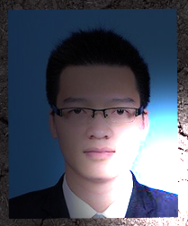

<h1 align="center">
	3D Construction Algorithms Approaches
</h1>

## Firework Particles Simulations

After the confirmation of applying OpenGL for the next stage of data augmentation works, in order to reinforce my
C++ skill which I have just scratched the surface in Robotics module and accomplish a higher programming standard, on the other hand, prepare for learning the OpenGL package, I have followed another online tutorial of manipulating linear algebra functions to create a particle fire simulation program in C++. The brought me deeper interpretation in 3D linear space and the actualisation via low-level SDL programming.

The GIFs looking like randomly generated firework are actually following rigorous and precise functions that based on 3D linear transformations and time. 

- Definition of boundary conditions let enables the particles to bound back when colliding with the frame wall of the window. 
- The colour is a 4-dimension vector consists of RGB and opacity
- The smoothing effect is created by applying instant gaussian blur of 3 x 3 kernel on particles.

<table>
  	<tr>
	    <th>Beginning, particles gradually grow</th>
	    <th>Big Contrast Tone Change</th>
	    <th>Ending, particles gradually fade out</th>
  	</tr>
  	<tr>
	    <td></td>
	    <td></td>
	    <td></td>
  	</tr>
</table>

The completed project can be found with this link: [https://github.com/Antimony51122/CPP/tree/master/Udemy_Fundamental_Tutorials/chap08_particle_fire_simulation_project](https://github.com/Antimony51122/CPP/tree/master/Udemy_Fundamental_Tutorials/chap08_particle_fire_simulation_project)

 

## OpenGL Approaches

> IMPORTANT: once again, I am not permitted to show the data set I have augmented for the real training set due to sensitivity reasons. However, I show materials of various texture and surface appearances which can show similar effects. 

### Low lighting intensity: mimicking the appearance in dark night, 

For the first scene, I have placed various models regarding different texture and surface appearances to mimic a range of scenarios:

<table>
  	<tr>
	    <th>Camera Movement Forwards and Backwards</th>
	   	<th>Camera Movement left and right</th>
  	</tr>
  	<tr>
	   	<td></td>
	   	<td></td>
  	</tr>
</table>

- Ceramic Rabbit: a clean pure white surface of that responds to relatively sharper specular lighting. shiny spot towards the camera corresponding to the shooting angle of the specular light
- Wood Crate & Barrel: a mixture relatively more dirty turbid colour with a texture that specular lighting contributes to a much lower extent. The diffuse reflection take control of the appearance here.
- Rusty Metal Robot: metal has a very sharp specular lighting, however the rust makes the surface appearance turbid. Thus the comparing with the pure reflection for the ceramic one, the reflection in this case is a mixture of the light colour and the colour of the surface texture.

**Firstly Let's have a clear look at the models under a directional lighting (sunlight for instance)**

<table>
  	<tr>
    	<th>Directional Shadow</th>
  	</tr>
  	<tr>
    	<td></td>
  	</tr>
</table>

**Appearance under dark night**

<table>
  	<tr>
    	<th>Ceramic Rabbbit</th>
    	<th>Wood Crate</th>
    	<th>Rusty Metal Robot</th>
  	</tr>
  	<tr>
    	<td></td>
    	<td></td>
    	<td></td>
  	</tr>
</table>

For the environment build up, I setup a relatively darker scene to imitate the late night traffic scene:

- low lighting leads to low diffuse light that comes from scatter and bounce in many directions reaching spots that aren't in its direct vicinity. 
- a torch light source regarding phong lighting, mimicking the flashlight of surveillance cameras when trying to capture key features from the objective. The angle of the torch light has been set as slightly looking down to imitate the looking down shooting angle of the camera.

<table>
  	<tr>
    	<th>Flashing Torchlight focusing on rabbit</th>
    	<th>Flashing Torchlight on the whole scene</th>
  	</tr>
  	<tr>
    	<td></td>
    	<td></td>
  	</tr>
</table>

Investigation of Shadows: 

<table>
  	<tr>
    	<th>Directional Shadow</th>
  	</tr>
  	<tr>
    	<td></td>
  	</tr>
</table>

### Moving Point Light Source (Coloured)

<table>
  	<tr>
    	<th>Moving Point Lighting</th>
    	<th>Yellow Reflection of Point Lighting on the Rabbit</th>
  	</tr>
  	<tr>
    	<td></td>
    	<td></td>
  	</tr>
</table>

> As perceived from the first GIF, the reflection of specular light is a property of the material on the model object, the if we specify the colour (yellow, in this case), we can see yellow reflections mixing with the object's original colour being shown.

> From the second GIF, we can perceive yellow reflections orienting towards different angle due to the shoot in angle of the light from the point light. 

**An real example could be shown below:**

<table align="center" width=100%>
  	<tr align="center">
    	<th>Moving Point Lighting</th>
  	</tr>
  	<tr>
    	<td></td>
  	</tr>
</table>

> WARNING: no real ID photos from Huawei data set could be provided due to regulation constraints. The above uses 2 random photos grabbed from internet.

The 2D augmentation procedure follows:

1. Build the light scene environment.
2. Set the 112 x 156 dimensions as the image importing references.
3. Importing all images from the data-set directory by applying traversal algorithm (here only showing 2 for convenience)
4. Take screenshots regularly while the light swinging as the output image of augmentation.

The following is two sets of sample runs:

- The first set with simple white light:

<table align="center" width=100%>
    <tr align="center">
      <th>up left</th>
      <th>up</th>
      <th>up right</th>
      <th>left</th>
      <th>middle</th>
      <th>down left</th>
      <th>down right</th>
    </tr>
    <tr>
      <td></td>
      <td></td>
      <td></td>
      <td></td>
      <td></td>
      <td></td>
      <td></td>
    </tr>
</table>

> The last two pictures are the outputs that mimicking the back-light scenes

- The second set with pink light mimicking colouring lighting scenarios:

<table align="center" width=100%>
    <tr align="center">
      <th>up left</th>
      <th>up</th>
      <th>up right</th>
      <th>left</th>
      <th>middle</th>
      <th>right</th>
      <th>down left</th>
    </tr>
    <tr>
      <td></td>
      <td></td>
      <td></td>
      <td></td>
      <td></td>
      <td></td>
      <td></td>
    </tr>
</table>

 

# 2D to 3D Reconstruction

Firstly, let's look at how lighting might affect the facial contour perception: the recognition of facial features is based on the contours, however, contour isn't an abstract thing, instead, it can be defined as the contrast between brightness and colour features that we perceive to build the "edges" on faces. Therefore, as shown in below GIFs changing the light direction might vastly change the contour features hence the facial looking.

<table>
  	<tr>
	    <th>whirling light source</th>
	    <th>whirling light source with tone change</th>
	    <th>Swing light source</th>
  	</tr>
  	<tr>
	    <td></td>
	    <td></td>
	    <td width=27%></td>
  	</tr>
</table>

Unlike license plates, or even car body, human face is of a much more complicated shape that cannot be reconstructed with simple geometrical shapes. 

Yaw, pitch and roll variations appear to be the hardest augmentation to actualise using traditional image processing apart from applying GAN network due that not enough facial information could be collected for a "turn-around" action. Therefore we have to augment data either by making up fake details using GAN network or apply 3D reconstruction methods to emphasis on some of the features while suppressing the others to perform the yaw, pitch and roll modifications.

<h1 align="center">
	
</h1>

By utilising deep learning, a program that reconstruct human faces from 2D images to form 3D models that based on mapping human face to a series of simplified common facial models by anchor point recognition algorithms has been developed.

> check the project github: https://github.com/AaronJackson/vrn

<table align="center" width=100%>
  	<tr align="center">
    	<td width=49%></td>
    	<td width=49%></td>
  	</tr>
  	<tr align="center">
    	<th>Obama</th>
    	<th>Curie</th>
  	</tr>
</table>

**A standard approach could be shown via the coarse example below:**

<table>
  	<tr>
	    <th>Original image of human face</th>
	    <th>.obj model with colour information added into the scene</th>
  	</tr>
  	<tr>
	    <td></td>
	    <td width=56%></td>
  	</tr>
</table>

1. Input an image of human face into the 3D reconstruction algorithm and output an obj model with colour information already loaded.
2. Import the model into the OpenGL scene
3. Propose the swing light around the face and seek the effects changes
4. Take screenshots of the window and output as augmented data.

## Rapid Prototyping using Ae on Depth Image

From the Robotics Module, we have scratched the surface of depth image using KINECT depth camera. The outcome is mapping of numbers from 0 to 1 indicating the how far a certain pixel is from the camera. Being inspired by the knowledge about how to demonstrate depth information, I decided to prototype through Ae utilising the depth perception technology. 

> Instead of making up some features when reconstructing 3D facial models, the prototype doesn't create any new information. It only extracts existing information and create the 3D effect by emphasising on some features while suppressing the others. 

<table>
  	<tr>
    	<th>Exaggerated Prototype before Moderation</th>
    	<th>Mapping Facial Features onto Depth Map</th>
  	</tr>
  	<tr>
    	<td></td>
    	<td></td>
  	</tr>
</table>

<table>
  	<tr>
    	<th>Final Output</th>
  	</tr>
  	<tr>
    	<td></td>
  	</tr>
</table>