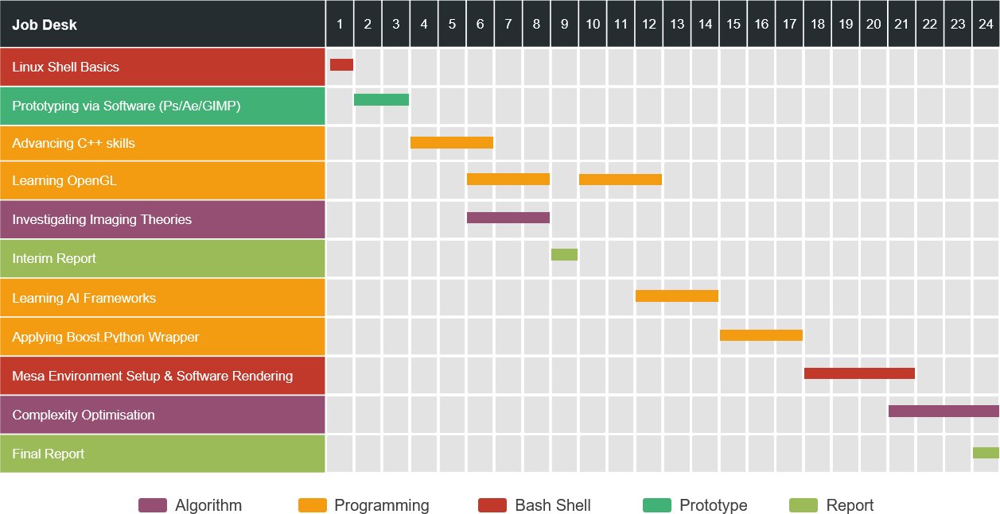

<h1 align="center">
	Reflection and Development
</h1>

### **Knowledge and Hard Skills Learning Progressions**

## Algorithm-wise:

- ### Interpretation in Neural Networks: 

	***Month-2 (01/May – 31/May) ~ Month-6 (01/Sept – 29/Sept)***

	Monthly course-meetings provided by the department where the advanced programmers talk about the forefront topics in AI neural networks and their previous achievements utilising these technologies and how to apply them to the current projects. These courses have boosted my learning progress and granted me with inspirations in interpretations in semantic segmentations, ReID, mutual learning and etc. this course vastly deepened my understandings in how my work will benefit the AI in facial recognition.

- ### Imaging Theory & Reducing Complexity:
 
	***Stage 1: Week-06 (19/May – 25/May) ~ Week-08 (02/Jun – 08/Jun)   
	   Stage 2: Week-21 (01/Sept – 07/Sept) ~ Week-24 (22/Sept – 28/Sept + 29/Sept (contract end date))***

	During stage 1, I followed online tutorials and applied the knowledge inherited from DE3 robotics module to acquire sufficient understanding of how translation and rotation matrices manipulate the camera view coordinate systems. In addition, I looked into the physics theories about the effect of focus and ambient, diffuse and specular lighting on the objects and materials and applied the equations to create vivid Phong lighting effects.
	
	During stage 2, I have been researching on open-source project on Github, and consecutively analysing on the speed results applying various algorithms in details, I have gained a glimpse of insight into the internal relationships between various ways of rendering and the compute power utilised and how to reduce the algorithm complexity in order to boost the efficiency of generation.

 

## Programming-wise:

- ### Environment construction: 

	***Stage 1: Week-01 (17/Apr – 22/Apr)  
	   Stage 2: Week-19 (18/Aug – 24/Aug) ~ Week-21 (01/Sept – 07/sept)***

	During stage 1: through the training from the technician, I have been granted the knowledge of Linux shell structure such as PATH variables exporting. A fully detailed documentation about Dockers and version controls has also been provided by the technician in order to help new employees quickly forge themselves into the industry standard programming mode.

	During stage 2: due to lacking GPU rendering power, I investigated online about software rendering. With the instruction from the technician, I have gained the knowledge of Mesa package, LLVM software rendering pipeline with SCon compilation and obtained a very detailed instruction noting the ways tackling all compilation conflicts during construction of software render environment. Other than that, I learned writing Cmakefiles from scratch in order to customise the compilation process.

- ### AI Frameworks:

	***Week-12 (30/Jun – 06/Jul) ~ Week-14 (14/Jul – 20/Jul)***

	By reading through the document provided by and department and supplementary tutorials from Udemy, I have grasped the usage of AI frameworks like Tensorflow and Caffe. These have granted me with the ability to perform simple validations on the neural networks to obtain loss and accuracy results according to various parameters based on the augmented dataset for verification.

- ### C++ and OpenGL programming: 

	***Stage 1: Week-06 (19/May – 25/May) ~ Week-08 (02/Jun – 08/Jun)  
	   Stage 2: Week-10 (16/Jun – 29/Jun) ~ Week-12 (30/Jun – 06/Jul)***

	As not being a computer science student, my C++ programming skill was not as proficient as the professionals. In order to reinforce the basic C++ programming skills inherited from DE3 Robotics project and master the usage of OpenGL packages, I have gone through fundamental learning documentation provided by the department and online training courses. In addition, communications with some experts from the AR/VR department have helped me tackling unusual problems and helped me acquiring more dexterous C++ and OpenGL programming skills eventually.

	During stage 1: I have been learning basic vertex and fragment shader language in C and comprehend the expressions and calculations with vec2, 3, 4. Furthermore, I investigated into distinguishing the various colour and brightness contrast effects each of ambient, diffuse and specular lighting on the objects and materials.
	
	During stage 2, I investigated deeper into shadowing effects and programmed vividly both directional shadows and point shadows.

- ### Wrapper:

	***Week-15 (21/Jul – 27/Jul) ~ Week-17 (14/Jul – 20/Jul)***

	As mentioned above, the program I have developed has to be wrapped in a portable library. I achieved by learning the Boost.Python package which can enable using simple python lines to call very complicated C++ functions. Furthermore, through learning the package, I got an insight of how industry standard programming manages and coordinate portability and finish of one’s work. 

 

## Software-wise

- ### Prototyping tools:

	***Week-02 (23/Apr – 29/Apr) ~ Week-03 (30/Apr – 04/May)***

	By finishing online courses on image processing software and, I have extended my ability in prototyping using PS inherit from DE projects. In addition, through help from colleagues, I have grasped how to GIMP which could be specified as the Linux version of Photoshop and write plug-ins to customise the usage and automatize the process of bulk processing.  

- Shadows
	- Directional Shadows
	- Point Shadows

 

#### Boost Python

- **Library Build & Compilation**
- **Visual Studio Environment Setup**
- **The `BOOST_PYTHON_MODULE` Macro**

- learning software rendering
- **mesa** packages
- **llvm**

##### Week-21 (01/Sep - 07/Sep)

##### Week-22 (08/Sep - 14/Sep)

learning **Cmake**, compiling own algorithms

# Next Step:

## OpenGL:

- **Sky Box Background Scene Reconstruction**

## GIMP?

- **Plug-in / Fu-Script Writing**

back-light

## inspirations:

### Depth Mapping method, why Bu\_Kao\_Pu?!

### OpenGL speed vs. OpenCV speed in large bulk rendering

### off-screen rendering

### c++ multi-threading

- https://solarianprogrammer.com/2011/12/16/cpp-11-thread-tutorial/
- http://www.runoob.com/cplusplus/cpp-multithreading.html

### python script executing terminal commands with CPU multi-processing

### traverse files in a directory

## algorithm-wisely

### filtering & mip-mapping

- nearest
- linear
- anisotropic 

## researches: ways that don't work:

### unity-plugin

## future: room for optimisation:

### shaders --> optimise vertex shader

### cover: glasses, mouth-mask

 

---

### let the world recognise us

