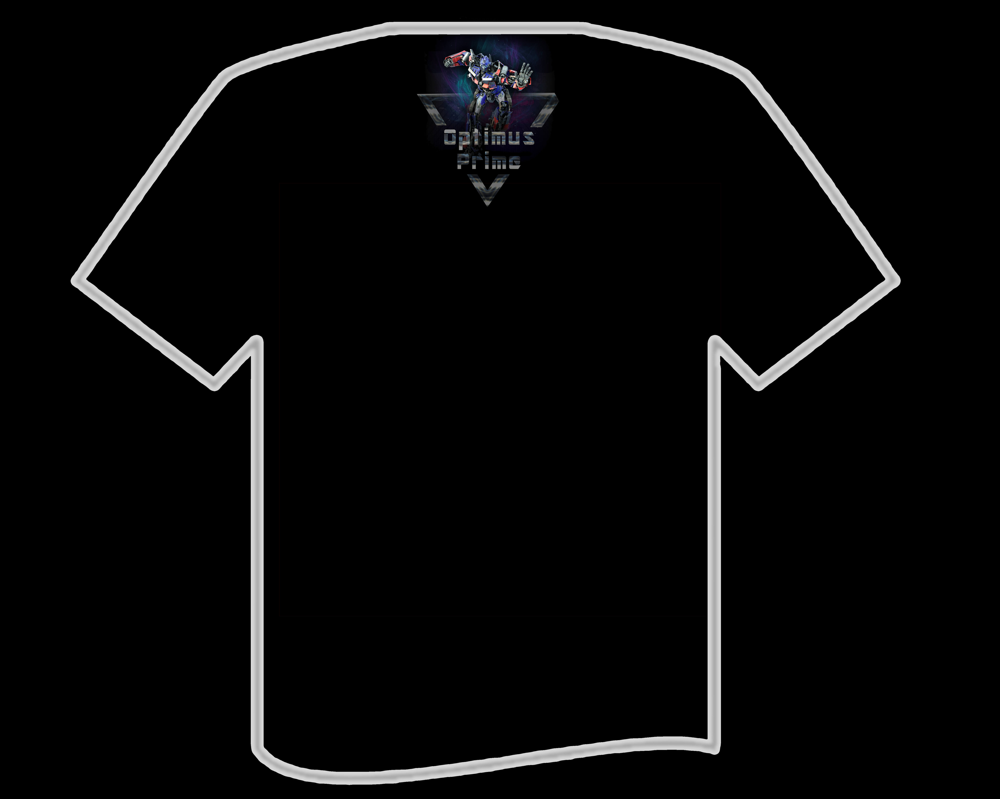
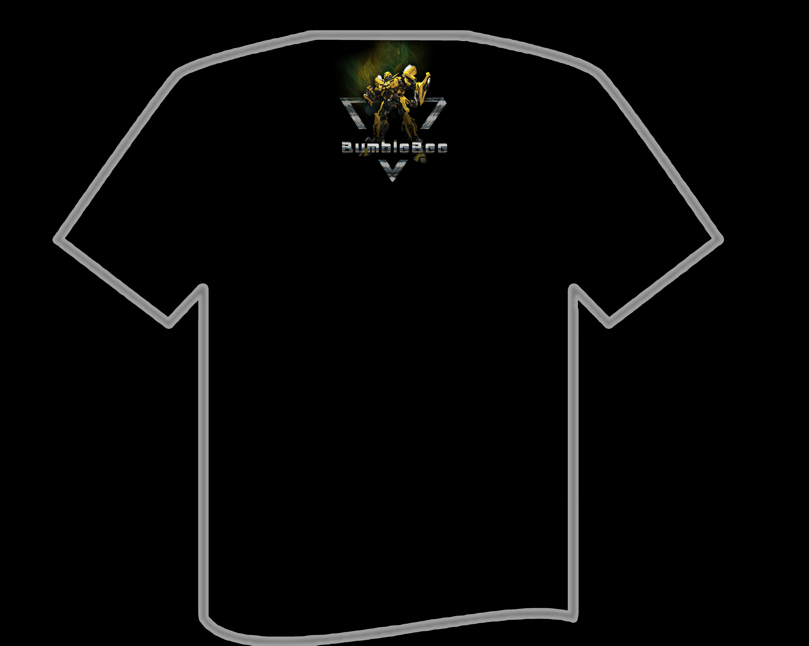
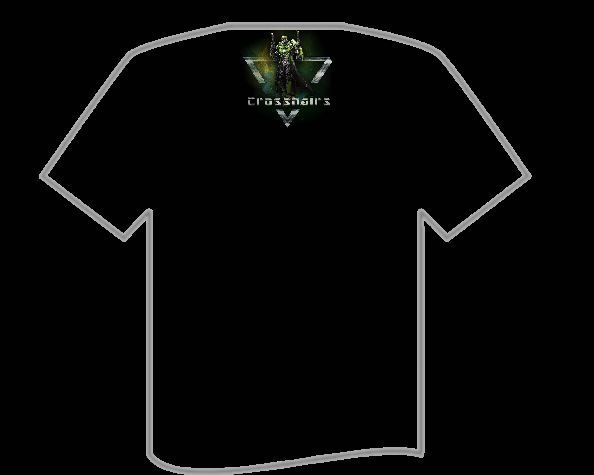
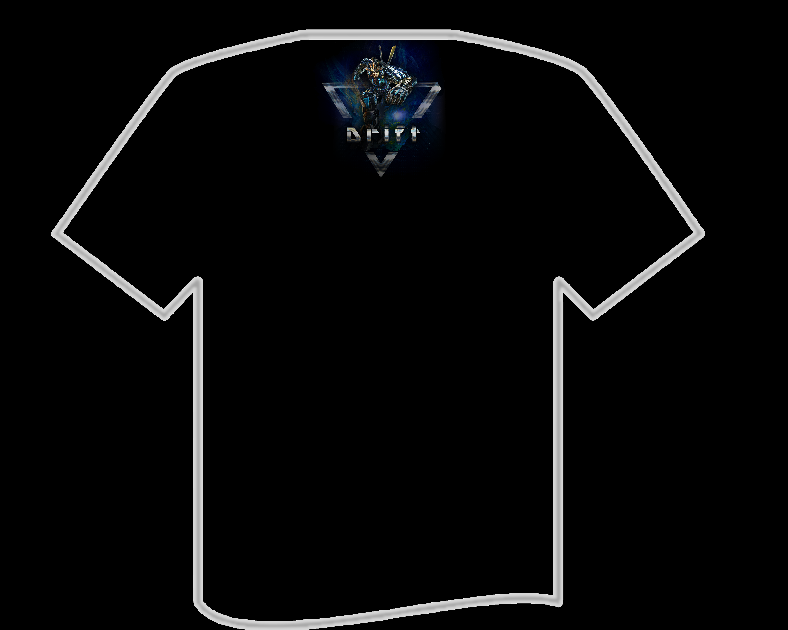
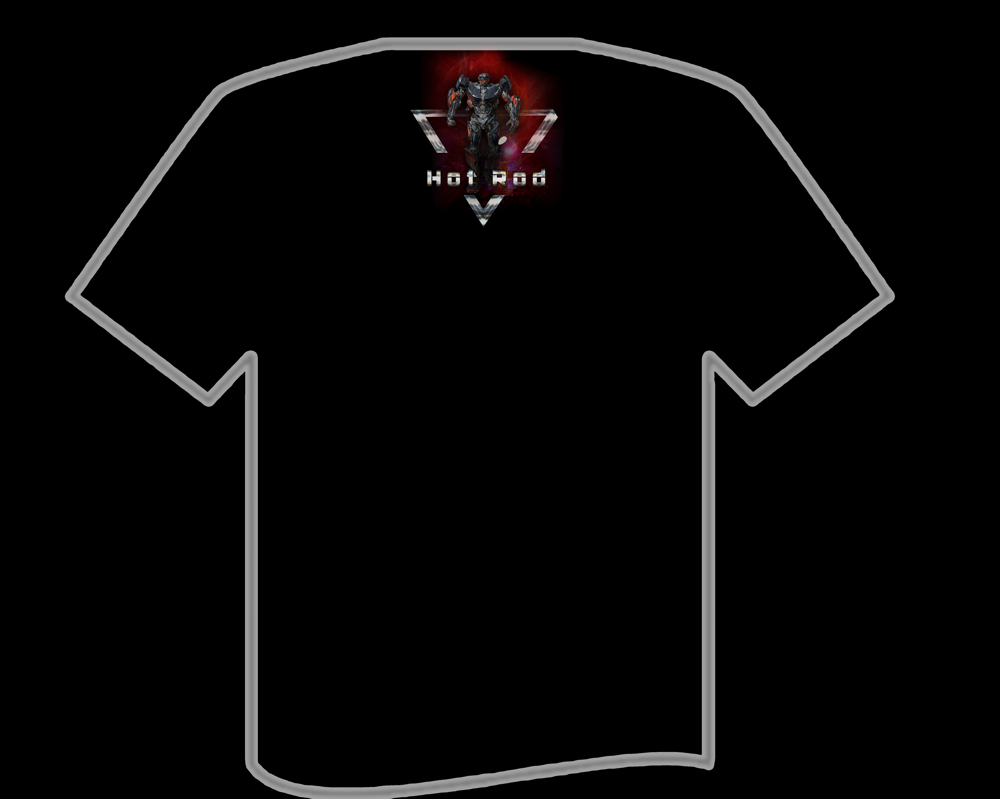

<h1 align="center">
	Team Cloth Design
</h1>

Apart from all those coding works, frequent mobilisation activities were held to bring fun to the team. During one celebration activity for the delivery of the Car ID Recognition part, I took the responsibility to design a team cloth and slogan. 

The slogan "Let the World recognize us" has double meanings: the ostensible meaning is letting the world recognise our team due that we are the forefront of video surveillance AI. Another meaning behind is hidden in the word "recognize" which can be both interpreted as realisation of a being or the technological recognition of an ID using the AI.

The idea of the cloth was using transformers as the main character and place a scene of each of them in car mode in the front and robot mode in a smaller size in the back below the collar. Accompanying by the slogan, expressing the funny meaning that our algorithm is powerful enough to recognise the robot ID of a certain transformer from their car mode.

We finally chose 5 autobots: 

- **Optimus Prime** (Only 1 produced for the Project leader)
- **Bumblebee**
- **Crosshair**
- **Drift**
- **HotRod**

> Apart from the most famous Optimus Prime and Bumblebee, the selection of the other 3 were according to the purpose fulfilling one each for **RGB**.

### Optimus Prime

<table>
  	<tr>
	    <th>Front</th>
	    <th>Back</th>
  	</tr>
  	<tr>
	    <td></td>
	    <td></td>
  	</tr>
</table>

**Prototype with cloth contour outline:**

<table>
  	<tr>
	    <th>Front with full size scene</th>
	    <th>Back with smaller size just below the collar</th>
  	</tr>
  	<tr>
	    <td></td>
	    <td></td>
  	</tr>
</table>

 

### BumbleBee

<table>
  	<tr>
	    <th>Front</th>
	    <th>Back</th>
  	</tr>
  	<tr>
	    <td></td>
	    <td></td>
  	</tr>
</table>

**Prototype with cloth contour outline:**

<table>
  	<tr>
	    <th>Front with full size scene</th>
	    <th>Back with smaller size just below the collar</th>
  	</tr>
  	<tr>
	    <td></td>
	    <td></td>
  	</tr>
</table>

 

### Crosshair

<table>
  	<tr>
	    <th>Front</th>
	    <th>Back</th>
  	</tr>
  	<tr>
	    <td></td>
	    <td></td>
  	</tr>
</table>

**Prototype with cloth contour outline:**

<table>
  	<tr>
	    <th>Front with full size scene</th>
	    <th>Back with smaller size just below the collar</th>
  	</tr>
  	<tr>
	    <td></td>
	    <td></td>
  	</tr>
</table>

### drift

<table>
  	<tr>
	    <th>Front</th>
	    <th>Back</th>
  	</tr>
  	<tr>
	    <td></td>
	    <td></td>
  	</tr>
</table>

**Prototype with cloth contour outline:**

<table>
  	<tr>
	    <th>Front with full size scene</th>
	    <th>Back with smaller size just below the collar</th>
  	</tr>
  	<tr>
	    <td></td>
	    <td></td>
  	</tr>
</table>

### Hot-Rod

<table>
  	<tr>
	    <th>Front</th>
	    <th>Back</th>
  	</tr>
  	<tr>
	    <td></td>
	    <td></td>
  	</tr>
</table>

**Prototype with cloth contour outline:**

<table>
  	<tr>
	    <th>Front with full size scene</th>
	    <th>Back with smaller size just below the collar</th>
  	</tr>
  	<tr>
	    <td></td>
	    <td></td>
  	</tr>
</table>